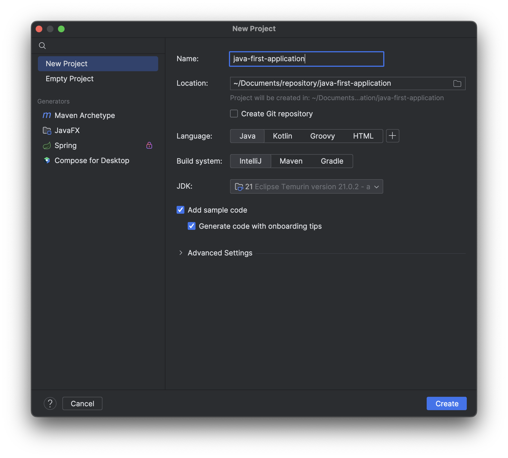

# JAVA First Application

A JAVA first application.

## Table of Contents

- [Installation](#installation)
- [Setup](#setup)
- [Tips about IntelliJ IDEA](#tips)

## Installation

Instructions on how to install and set up your project.

## Setup

## Tips

[https://www.alura.com.br/artigos/intellij-idea-dicas-truques-usar-no-dia-a-dia](https://www.alura.com.br/artigos/intellij-idea-dicas-truques-usar-no-dia-a-dia)
