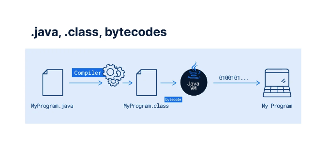

# Understanding

## Intro

Java is a powerful and versatile programming platform, with almost 30 years of history and evolution. If you want to know more details about Java's trajectory, read the article Java: Everything you need to know about the language. Discover the history and architecture of the language, learn about its main characteristics and advantages, and even find valuable tips that will help you on your learning journey.

[Learn More](https://www.alura.com.br/artigos/java)

## What is Java?

Java, as a programming platform, was born in 1995 within the laboratories of the company Sun Microsystem as a result of extensive scientific and technological research. The Java platform provides a complete environment for developing and executing programs, consisting of:

* A high-level object-oriented programming language;
* Virtual Machine (Java Virtual Machine or JVM), which guarantees platform independence, as the code runs in the virtual machine and it can be ported to other platforms such as Windows or Linux;
* Java Runtime Environment or JRE, which adds the virtual machine and some resources for running Java applications; It is
* Java Development Kit or JDK, which is a set of utilities that supports application development.

In Java, programs are written in a file with the .java extension, which in a later process will be compiled to files with the .class extension. These, in turn, contain the codes to be executed in the virtual machine, the bytecodes.

The **JVM** is available for most operating systems on the market, so we can run the same Java application on Windows, macOS, Linux, Solaris, among others. This functionality implements one of the concepts that were born strong with Java:

> "Write once, Run Anywhere!" (WORA)

## JVM: understanding the flow

[https://www.alura.com.br/artigos/jvm-conhecendo-processo-execucao-de-codigo](https://www.alura.com.br/artigos/jvm-conhecendo-processo-execucao-de-codigo)

The differences between **JVM**, **JRE** and **JDK**:

* **JVM (Java Virtual Machine)** - is the Java Virtual Machine responsible for executing the bytecode;

* **JRE (Java Runtime Environment)** - Java Execution Environment that provides Java standard libraries for the JDK to compile your code and for the JVM to execute your program;

* **JDK (Java Development Kit)** - Java Development Kit responsible for compiling source code into bytecode.